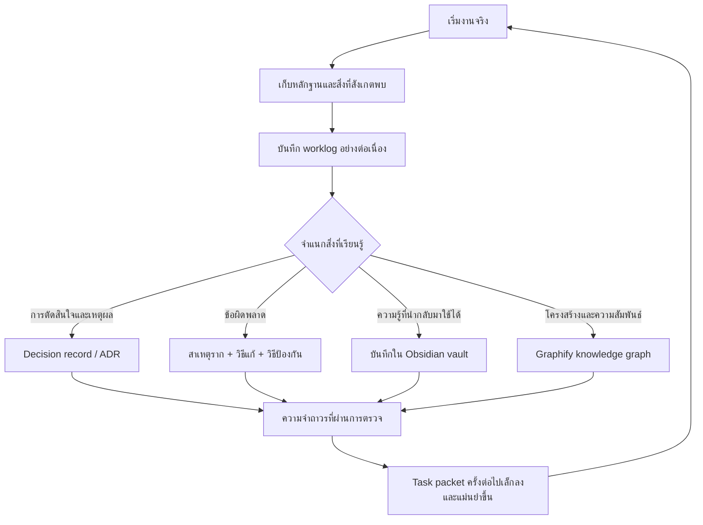
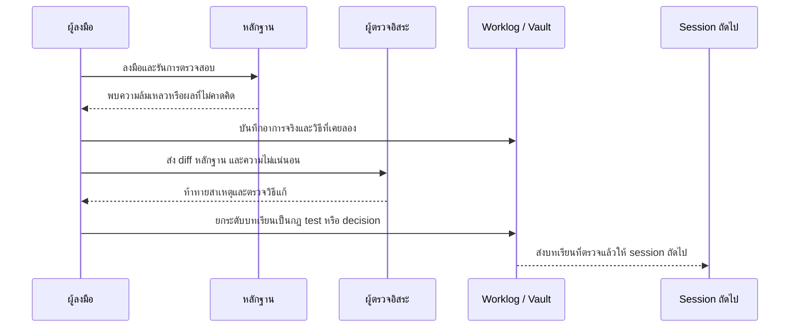
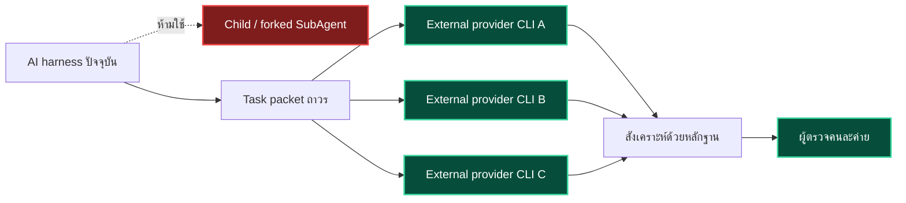
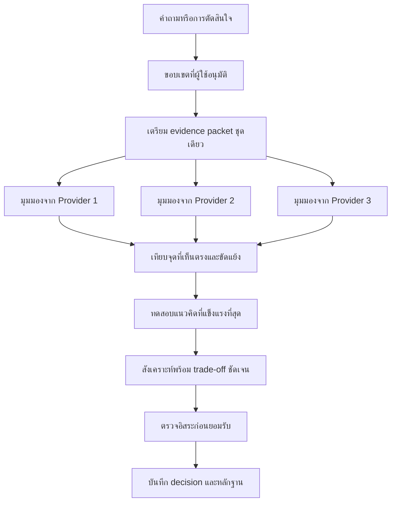
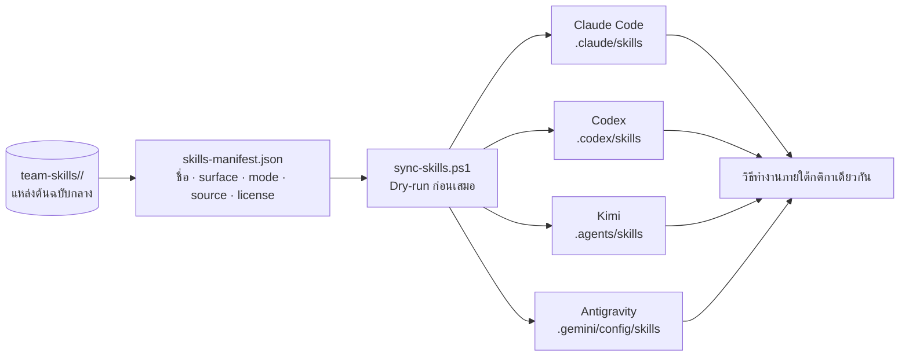
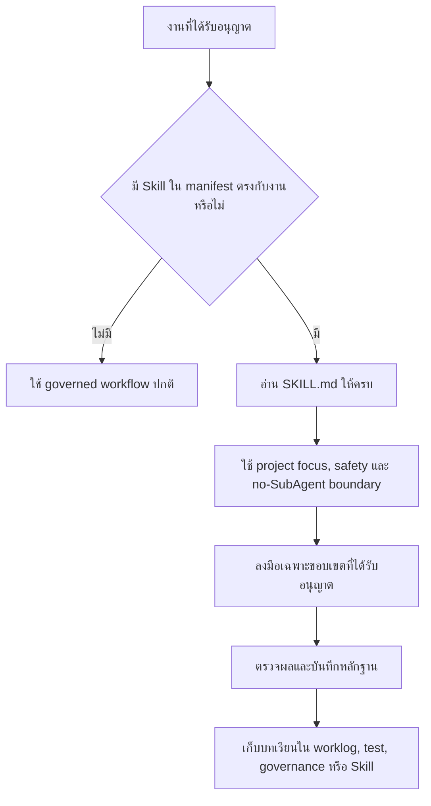
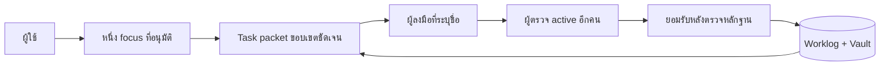

<div align="center">

# Agent Academy

### ระบบปฏิบัติการแบบ Local-first สำหรับทีมผู้ช่วย AI

**ความทรงจำที่เติบโตตามการใช้งาน · การตรวจข้ามค่าย · ไม่ใช้ SubAgent · ทำงานผ่าน CLI**

[](LICENSE)
[](INSTALL.md)
[](#ความเป็นส่วนตัวและความปลอดภัย)
[](governance/no-subagents.md)
[](#บัญชีสมาชิกและ-api-key)
[](#ทีมเริ่มต้นห้าคนแต่ปรับเปลี่ยนได้)
[](#skills-แบบพกพาที่ติดตั้งมาให้)

สร้างและพัฒนาโดย **Pokpong Sittisak**

[English](README.md) · **ภาษาไทย**

[ทำไมระบบจึงเก่งขึ้น](#ระบบเก่งขึ้นทุกครั้งที่ทำงาน) · [ทำไมไม่ใช้ SubAgent](#ไม่ใช้-subagent-แต่ใช้มุมมองจาก-ai-คนละค่ายจริง) · [การประชุมหลายค่าย](#ความหลากหลายของผู้ให้บริการและรูปแบบการประชุม)

[เริ่มติดตั้ง](#คู่มือติดตั้งแบบละเอียด) · [Skills](#skills-แบบพกพาที่ติดตั้งมาให้) · [Workflow](#ระบบทำงานอย่างไร) · [Obsidian](#obsidian-สมองที่สองของทีม) · [Graphify](#graphify-กราฟความรู้ของระบบ)

</div>

---

Agent Academy เปลี่ยนเครื่องมือ AI แบบ command-line หลายตัวให้ทำงานเป็นทีมภายใต้กติกาเดียวกัน ทุกการติดตั้งมีขอบเขตอำนาจที่ชัดเจน มีโครงการที่ได้รับอนุมัติให้โฟกัสเพียงหนึ่งโครงการ มี task packet ที่ตรวจสอบย้อนหลังได้ มีการตรวจงานจาก AI คนละค่าย มีคลัง Skills กลาง และมีหน่วยความจำภายนอกที่ยังคงอยู่แม้เปลี่ยน session หรือโมเดล

ระบบจะมีความสามารถมากขึ้นเมื่อใช้งานต่อเนื่อง ไม่ใช่เพราะแอบฝึก foundation model ใหม่ แต่เพราะมันเก็บการตัดสินใจ หลักฐาน ข้อผิดพลาด บริบทโครงการ และความสัมพันธ์ที่ session ในอนาคตสามารถค้นคืนและตรวจสอบได้

> **ฉบับสาธารณะที่เป็นกลาง:** ตัวตนที่มาพร้อมเทมเพลตเป็นชื่อบทบาททั่วไปที่สร้างขึ้นใหม่ทั้งหมด เปลี่ยนชื่อและบุคลิกได้ Repository นี้ไม่มีข้อมูลระบุตัวผู้ใช้ credential สถานะการล็อกอิน ประวัติการทำงานเดิม หรือข้อมูลเฉพาะของโครงการส่วนตัว

> [!IMPORTANT]
> **Agent Academy ไม่ใช้ platform SubAgent โดยเด็ดขาด** child agent, forked agent, nested agent, background agent หรือหน้าจอ `Waiting for agents` ไม่ใช่สมาชิกทีม และไม่สามารถเป็นผู้ลงมือ ผู้ตรวจ ผู้มอบหมาย ผู้อนุมัติ หรือหลักฐานการตรวจอิสระได้ การร่วมงานจริงต้องเรียก CLI ของผู้ให้บริการภายนอกที่ล็อกอินแยกกัน ผ่าน wrapper โดยตรงและ task packet ที่บันทึกถาวร

> [!NOTE]
> **แกนหลักของ Academy ไม่ต้องใช้ API key** ติดตั้งระบบ แล้วล็อกอิน CLI แต่ละค่ายด้วยวิธีทางการของผู้ให้บริการ ข้อมูลรับรองทั้งหมดต้องอยู่นอก repository นี้ ผู้ให้บริการเสริมบางรายอาจต้องใช้ key ของตนเอง แต่ key นั้นต้องอยู่ในพื้นที่ตั้งค่าที่ปลอดภัยของผู้ให้บริการและห้ามกลายเป็นเนื้อหาของ Academy

## ระบบเก่งขึ้นทุกครั้งที่ทำงาน

Agent Academy ไม่ได้เก็บเพียงคำตอบสุดท้าย แต่เก็บเส้นทางที่ทำให้คำตอบนั้นน่าเชื่อถือด้วย ได้แก่ เป้าหมาย ข้อจำกัด หลักฐาน การตัดสินใจ ทางเลือกที่ไม่เลือก ความพยายามที่ล้มเหลว สาเหตุราก ผลการตรวจสอบ ความเสี่ยงที่ยังเหลือ และ checkpoint ที่ใช้กลับมาทำต่อได้ทันที



ทุกวงรอบการทำงานควรเก็บข้อมูลสำคัญอย่างน้อยห้าอย่าง:

| สิ่งที่บันทึก | ประโยชน์ในครั้งถัดไป |
|---|---|
| **การตัดสินใจ** | session ใหม่รู้ว่าเลือกอะไร เพราะอะไร และเคยปฏิเสธทางเลือกใดไปแล้ว |
| **ข้อผิดพลาดหรือความพยายามที่ล้มเหลว** | ทีมไม่ทำคำสั่ง สมมติฐาน สถาปัตยกรรม หรือเส้นทาง transport ที่เคยล้มเหลวซ้ำอีก |
| **หลักฐาน** | สมาชิกในอนาคตแยกข้อเท็จจริงที่ตรวจแล้วออกจากความทรงจำที่ฟังดูมั่นใจแต่ไม่มีหลักฐานได้ |
| **Checkpoint** | กลับมาทำต่อได้หลัง context เต็ม โปรแกรมล่ม โควตาหมด provider ใช้งานไม่ได้ หรือสลับโครงการ |
| **กฎป้องกัน** | บทเรียนที่สำคัญถูกยกระดับเป็น test, governance rule, skill หรือ checklist แทนที่จะเหลือเพียงเรื่องเล่า |

ผลลัพธ์คือความฉลาดเชิงปฏิบัติการที่สะสมเพิ่มขึ้น session ใหม่เริ่มด้วยบริบทที่เกี่ยวข้องมากกว่าเดิมและทำผิดซ้ำน้อยลง นี่คือ **การเรียนรู้ภายนอกที่เปิดตรวจสอบได้** ไม่ใช่การ fine-tune อัตโนมัติ การเรียนรู้ลับของโมเดล หรือการแก้ไขตัวเองโดยไม่มีผู้ตรวจ

### จากข้อผิดพลาดสู่ระบบที่แข็งแรงกว่าเดิม



## ไม่ใช้ SubAgent แต่ใช้มุมมองจาก AI คนละค่ายจริง

คำว่า *agent* ถูกใช้หลายความหมาย Agent Academy จึงกำหนดเส้นแบ่งชัดเจนระหว่าง child process ที่แพลตฟอร์มสร้างขึ้น กับ session ของ AI ภายนอกที่ยืนยันตัวตนและใช้โควตาแยกกันจริง



| คำศัพท์ | ความหมายใน Agent Academy |
|---|---|
| **Member** | ตัวตนที่อยู่ใน `governance/roster.json` มีอำนาจ สถานะพร้อมทำงาน inbox/outbox ถาวร และ transport ที่ตั้งค่าไว้ |
| **Provider** | ผู้ให้บริการโมเดลภายนอก เช่น Anthropic, OpenAI, Google, Moonshot AI หรือ Z.AI |
| **Session** | การเรียก CLI จริงหนึ่งครั้ง ภายใต้บัญชี การยืนยันตัวตน และโควตาของผู้ให้บริการนั้น |
| **Wrapper** | ตัวนำส่งในเครื่องที่เปิด CLI ส่ง task packet และรับหลักฐานกลับมา |
| **SubAgent** | worker ลูกที่ถูกสร้างอยู่ภายใน harness ปัจจุบัน ห้ามใช้ไม่ว่าจะตั้งชื่อ บุคลิก หรืออธิบายให้ดูเหมือนสมาชิกทีมเพียงใด |

เหตุผลที่ห้าม SubAgent อย่างจริงจัง:

- child agent มักสืบทอดโมเดล ตระกูลผู้ให้บริการ บริบท จุดบอด และรูปแบบความล้มเหลวเดียวกับ harness หลัก
- การเปลี่ยนชื่อ child agent ให้เป็นสมาชิกอีกคนสร้างภาพลวงตาว่ามีการตรวจอิสระ ทั้งที่ไม่ได้มาจากอีกค่าย
- child agent ของแพลตฟอร์มมักมีหลักฐานด้านตัวตน transport audit และ failure ที่อ่อนกว่า task packet ที่ส่งถึง provider จริง
- ข้อความ `Waiting for agents` พิสูจน์เพียงว่า harness สร้าง agent ลูก ไม่ได้พิสูจน์ว่า Claude, Codex, Gemini, Kimi หรือ GLM ได้ตรวจงานอย่างอิสระ

เป้าหมายไม่ใช่การเปิด AI ให้ได้จำนวน process มากที่สุด แต่คือการได้ **แนวทางการให้เหตุผลที่แตกต่างกันจริง** แล้วนำมาเทียบกับหลักฐานเดียวกัน

## ความหลากหลายของผู้ให้บริการและรูปแบบการประชุม

โมเดลแต่ละค่ายผ่านการฝึก การปรับแนวทาง ระบบให้บริการ และเครื่องมือที่ต่างกัน จึงมองเห็นความเสี่ยง เสนอ abstraction และพลาดในจุดที่ต่างกัน Agent Academy ใช้ความแตกต่างนี้อย่างตั้งใจ แทนการนับโมเดลค่ายเดียวกันห้าตัวว่าเป็นห้าความเห็นอิสระ



Transport Tier 1 ที่มาพร้อมระบบอาจเรียกแต่ละ provider ตามลำดับ ความเป็นอิสระเกิดจาก runtime คนละค่ายและคำตอบที่มีหลักฐานแยกจากกัน ไม่จำเป็นต้องทำงานพร้อมกัน

### ต้องมีผู้ให้บริการกี่ค่าย

| จำนวนค่ายที่แตกต่างกัน | รูปแบบการทำงาน | สิ่งที่ได้รับ | สิ่งที่ยังอ้างไม่ได้ |
|---:|---|---|---|
| **1** | Solo Academy | ใช้ focus control, worklog, vault, skills และ governance ในเครื่องได้ครบ | ไม่มีการประชุมข้ามค่าย ไม่มีความเห็นอิสระต่าง provider และสมาชิกคนเดียวไม่ผ่าน maker/reviewer gate สำหรับ code |
| **2** | การประชุมขั้นต่ำ | มีการโต้แย้งหรือตรวจ maker/reviewer ระหว่างโมเดลสองตระกูลจริง | อาจเกิดทางตันสองฝ่ายหรือมีสมมติฐานที่พลาดร่วมกัน |
| **3** | ค่าพื้นฐานที่แนะนำ | ทำ triangulation ได้: คนหนึ่งเสนอ คนหนึ่งท้าทาย และอีกคนตัดสินด้วยการทดสอบ | ยังอาจมี bias จากข้อมูล เครื่องมือ หรือ ecosystem ที่สัมพันธ์กัน |
| **4–5** | ทีมที่ครอบคลุมสูง | จุดแข็งหลากหลาย รับมือ provider ล่มหรือโควตาหมด และมีโอกาสพบแนวทางที่คาดไม่ถึงมากขึ้น | จำนวนโมเดลไม่สามารถแทนหลักฐาน test หรืออำนาจตัดสินใจของมนุษย์ได้ |

**คำแนะนำจากผู้พัฒนา:** ใช้อย่างน้อย **สามค่าย** เพื่อสมดุลด้านความหลากหลาย ค่าใช้จ่าย และการประสานงาน สองค่ายคือขั้นต่ำสำหรับการประชุมข้าม provider จริง หนึ่งค่ายยังใช้ระบบทำงานเดี่ยวได้ แต่ให้การอภิปรายจากหลายบริษัทตามวัตถุประสงค์หลักของระบบไม่ได้

### ชุดห้าค่ายที่ผู้พัฒนาเคยใช้งานจริง

ระบบส่วนตัวต้นฉบับของ **Pokpong Sittisak** เคยทำงานร่วมกับผู้ให้บริการห้าตระกูล:

| ที่นั่งในทีม | ค่ายที่ผู้พัฒนาเคยใช้ | บทบาทที่ตั้งใจให้ช่วย |
|---|---|---|
| Lead | **Claude / Anthropic** | ประสานงาน สังเคราะห์ ยอมรับผล และตัดสินงานบริบทยาว |
| Deputy | **Codex / OpenAI** | ลงมือพัฒนา debug ตรวจสอบ และทำ failover |
| Analyst | **Gemini / Google** | วิเคราะห์อิสระ วิจัย และตรวจหลักฐาน |
| Challenger | **Kimi / Moonshot AI** | เสนอทางเลือก ท้าทายสมมติฐาน และสร้างความเห็นต่าง |
| Steward | **GLM / Z.AI** | ปิดงานเชิง production เพิ่มความหลากหลายของโมเดล และตรวจงานขอบเขตชัดเจน |

ตารางนี้บันทึกประสบการณ์ของผู้พัฒนา ไม่ได้หมายความว่าค่ายใดดีที่สุดสำหรับบทบาทหนึ่งเสมอไป ผู้ใช้ควรเลือกจากความพร้อม ภาษา ความเป็นส่วนตัว เครื่องมือ โควตา และกฎหมายในพื้นที่ของตน

## บัญชีสมาชิกและ API key

Agent Academy ออกแบบมาสำหรับผู้ที่ต้องการใช้งาน AI หลายค่ายผ่าน CLI อย่างสะดวก โดยไม่ต้องสร้างหรือดูแล API orchestration service เอง

### สิ่งที่แกนหลักของระบบต้องใช้จริง

1. Repository นี้และ PowerShell
2. AI CLI ที่รองรับอย่างน้อยหนึ่งตัว
3. การล็อกอิน CLI ด้วยขั้นตอนทางการของค่ายนั้น
4. `providers.json` ที่มีเพียง executable และ argument metadata — **ห้ามมี credential**

Installer, roster, task packet, vault, wrapper และ governance ของ Academy ไม่ต้องใช้ API key เพื่อความสะดวกในชีวิตประจำวัน ผู้พัฒนาแนะนำให้มีสมาชิกแบบเสียเงินอย่างน้อยหนึ่งค่ายที่ให้โควตา CLI เพียงพอ ซึ่งอาจใช้ชื่อ **Plus**, **Pro**, **Max** หรือ *Coding Plan* ตามแต่ละผู้ให้บริการ นี่เป็นคำแนะนำด้านโควตา ไม่ใช่ข้อบังคับทางสถาปัตยกรรมหรือชื่อแพ็กเกจสากล

> [!CAUTION]
> แพ็กเกจ โควตา ภูมิภาค วิธีล็อกอิน และชื่อผลิตภัณฑ์เปลี่ยนแปลงได้เสมอ ตรวจเอกสารทางการก่อนสมัคร ห้ามวาง key, OAuth code, session token, recovery code หรือ browser cookie ลงใน repository, chat, task packet, screenshot หรือ worklog

### รูปแบบการเข้าใช้งานของแต่ละค่าย

ตรวจจากเอกสารทางการเมื่อ **2026-08-09**:

| ตัวอย่างผู้ให้บริการ | วิธีใช้งานแบบสะดวก | ความจริงเรื่อง API key | เอกสารทางการ |
|---|---|---|---|
| **Claude Code** | ล็อกอินผ่าน browser ด้วยบัญชี Claude Pro, Max, Team, Enterprise หรือ Console ที่รองรับ | การล็อกอินบัญชีทำให้ไม่ต้องใส่ API key ใน Academy และยังมีช่องทาง API/third-party provider แยกต่างหาก | [Claude Code setup](https://code.claude.com/docs/en/getting-started) |
| **Codex CLI** | ล็อกอินด้วยบัญชี ChatGPT โดยแพ็กเกจและ limit ขึ้นอยู่กับช่วงเวลา | ChatGPT sign-in ไม่ต้องให้ Academy จัดการ key ส่วนการใช้ API เป็นทางเลือกแยก | [Using Codex with a ChatGPT plan](https://help.openai.com/en/articles/11369540/) |
| **Gemini CLI** | ล็อกอิน Google OAuth มีทั้ง free tier สำหรับบุคคลและตัวเลือกองค์กรตามเอกสารทางการ | Google sign-in ใช้ได้โดยไม่ต้องจัดการ API key ส่วน API key และ Vertex AI เป็นทางเลือก | [Gemini CLI authentication](https://github.com/google-gemini/gemini-cli#-authentication-options) |
| **Kimi Code CLI** | ใช้ Kimi membership ผ่าน OAuth device login | รองรับทั้ง membership OAuth และ callable API key หากต้องการระบบ keyless ให้เลือก OAuth | [Kimi Code CLI getting started](https://www.kimi.com/help/kimi-code/cli-getting-started) |
| **GLM Coding Plan** | สมัคร Z.AI Coding Plan แล้วเชื่อมกับ coding tool ที่รองรับ | ขั้นตอนทางการปัจจุบันออก provider API key ให้ ต้องเก็บไว้ใน secure config ของเครื่องมือและห้ามใส่ใน Academy | [GLM Coding Plan quick start](https://docs.z.ai/devpack/quick-start) |

<details>
<summary><strong>ทำไมคำว่า “Agent Academy ไม่ต้องใช้ API key” จึงยังถูกต้อง</strong></summary>

Academy เป็นชั้น governance และ transport ไม่ใช่ชั้น billing ของโมเดล ระบบไม่ขอและไม่ต้องอ่าน key ผู้ให้บริการที่เลือกอาจยืนยันตัวตนด้วย OAuth, บัญชีสมาชิก, OS keychain, environment variable หรือ config ของผู้ให้บริการ ข้อมูลเหล่านั้นต้องอยู่ที่ขอบเขตของ provider

คุณสามารถใช้ Academy แบบล็อกอินด้วยบัญชีทั้งหมดได้ด้วยการเลือก CLI ที่รองรับ OAuth/browser login หากเพิ่ม provider ที่จำเป็นต้องใช้ key ก็ยังทำงานได้ แต่ key ต้องอยู่นอก repository และห้ามคัดลอกลง `providers.json`

</details>

### แนวทางเลือกสมาชิกให้เหมาะกับการใช้งาน

| เป้าหมาย | ชุดที่แนะนำ |
|---|---|
| ทดลองระบบด้วยค่าใช้จ่ายต่ำ | เริ่มจาก CLI ที่ล็อกอินทางการหนึ่งค่าย โดยเข้าใจว่ายังประชุมข้ามค่ายไม่ได้ |
| การร่วมงานจริงขั้นต่ำ | รักษาบัญชีสองค่ายให้มีโควตาพอสำหรับ maker/reviewer หรือการอภิปราย |
| สมดุลราคาและคุณภาพ | ใช้สามค่ายที่แตกต่างกัน โดยมักเป็นแพ็กเกจบุคคลแบบเสียเงินที่มีโควตา CLI ไว้ใจได้ |
| ความหลากหลายสูงสุดที่ผู้พัฒนาเคยใช้ | Claude + Codex + Gemini + Kimi + GLM โดยแต่ละค่ายล็อกอินและเชื่อมกับสมาชิกแยกกัน |

สมาชิกเป็นสิทธิ์ของบุคคลหรือองค์กรที่ซื้อ ห้ามแชร์บัญชีระหว่างคน หลีกเลี่ยง limit ของ provider หรือสมมติว่าเงื่อนไขของค่ายหนึ่งใช้กับอีกค่ายได้

## ทีมเริ่มต้นห้าคนแต่ปรับเปลี่ยนได้

Reference roster สาธารณะมีห้าที่นั่งถาวร เพราะเพียงพอสำหรับสาธิต lead, deputy, maker, challenger, analyst และ reviewer ข้ามหลาย provider แต่ **จำนวนสมาชิกกับจำนวนค่ายเป็นคนละเรื่อง** สมาชิกห้าคนที่ใช้ provider เดียวกันไม่ได้สร้างห้ามุมมองอิสระ

- **ใช้ให้น้อยลง:** ตั้งสมาชิกที่ไม่พร้อมเป็น on leave และเก็บประวัติของเธอไว้ ต้องมีสมาชิก active อย่างน้อยสองคนจึงยอมรับ code ตาม maker/reviewer gate ได้
- **เพิ่มสมาชิก:** ทำ roster migration อย่างตั้งใจ โดยเพิ่ม stable id, persona, inbox/outbox, provider mapping, manifest coverage และ test
- **เปลี่ยนชื่อได้:** display name และ persona text ปรับได้ระหว่าง onboarding
- **อย่าเปลี่ยน id แบบฉาบฉวย:** id เป็น compatibility key ที่ scripts และ paths ใช้อ้างอิง

การเพิ่มหรือลบที่นั่งถาวรทำได้ แต่เป็น governance/schema migration ไม่ใช่ toggle บรรทัดเดียว เพื่อป้องกันไม่ให้คำโฆษณาใน README ทำลาย dispatch, สิทธิ์ reviewer หรือประวัติถาวรโดยไม่รู้ตัว

## ทำไมต้อง Agent Academy

| ความสามารถ | สิ่งที่เปลี่ยนไป |
|---|---|
| **หนึ่ง execution focus** | ทีมทิ้งโครงการหนึ่งไปทำอีกโครงการเองไม่ได้ ผู้ใช้เท่านั้นที่อนุมัติการเปลี่ยน focus |
| **Maker + reviewer gate** | สมาชิกหนึ่งคนลงมือ และสมาชิก active อีกคนตรวจอย่างอิสระ |
| **Durable handoff** | งานและคำตอบอยู่รอดเหนือ context limit เพราะเก็บเป็นไฟล์ขนาดเล็กที่ตรวจย้อนหลังได้ |
| **Local-first memory** | Worklog, decision และ Obsidian vault อยู่ภายใต้การควบคุมของผู้ใช้ |
| **Portable skills** | คลัง Skill กลางหนึ่งชุดกระจายไป Claude Code, Codex, Kimi และ Antigravity ได้ |
| **Provider independence** | Wrapper เชื่อมสมาชิกจริงกับ runtime ที่กำหนดไว้โดยไม่ต้องเปิด server หรือ daemon ของ Academy |
| **ไม่ใช้ platform subagents** | child/forked/nested/background agent ปลอมเป็นสมาชิกหรือผ่าน review gate ไม่ได้ |

## Skills แบบพกพาที่ติดตั้งมาให้

Agent Academy มาพร้อม **28 Skills ที่คัดเลือกไว้** เพื่อให้การติดตั้งใหม่เริ่มด้วยวิธีทำงานทางวิศวกรรมร่วมกัน ไม่ใช่ผู้ช่วยห้าตัวที่ต่างคนต่างเดากระบวนการ Skill คือชุดคำแนะนำเฉพาะด้านที่บอก CLI ว่าเมื่อใดควรใช้ความสามารถนั้น ต้องเก็บหลักฐานอะไร ต้องเคารพขอบเขตใด และผลลัพธ์ที่เชื่อถือได้มีหน้าตาอย่างไร

Skill ไม่ได้ฝึกโมเดลใหม่ ไม่ได้ติดตั้ง service ลับ และไม่เพิ่มอำนาจให้ AI แต่ทำให้วิธีทำงานที่ทำซ้ำได้พกพาข้าม session และ provider ได้ Governance, project focus, การอนุมัติของผู้ใช้ และกฎห้าม SubAgent อยู่เหนือ Skill ทุกตัวเสมอ

> [!IMPORTANT]
> **Skill เป็นแนวทาง ไม่ใช่สิทธิ์** การโหลด `security-review` ไม่ได้อนุญาตให้อ่าน credential, `docker-patterns` ไม่ได้อนุญาตให้ deploy และ `graphify` ไม่ได้อนุญาตให้สร้าง child worker ทุก Skill ยังถูกจำกัดด้วย [`AGENTS.md`](AGENTS.md), [`governance/safety.md`](governance/safety.md) และ [`governance/no-subagents.md`](governance/no-subagents.md)

### คลังกลางหนึ่งชุด กระจายไปสี่ CLI



[`team-skills/skills-manifest.json`](team-skills/skills-manifest.json) คือแหล่งข้อมูลจริงที่เครื่องอ่านได้ ระบุว่าแต่ละ Skill ไปยัง surface ใด ใช้ junction หรือ mirror จริง มี overlay เฉพาะ provider หรือไม่ และงานภายนอกมีที่มากับ license ใด Claude Code, Codex และ Kimi ใช้ link หรือ mirror ตาม manifest ส่วน Antigravity ต้องรับโฟลเดอร์ mirror จริงเพราะ loader ของมันไม่ค้นพบ reparse point

ระบบจึงมี playbook ร่วมโดยไม่แกล้งทำว่าแต่ละ provider คือโมเดลเดียวกัน แต่ละ runtime ยังให้เหตุผลด้วยจุดแข็งของตน Skill เพียงจัดแนววิธีทำงาน มาตรฐานหลักฐาน และขอบเขตความปลอดภัย

### Skills ทั้ง 28 รายการ

| กลุ่มความสามารถ | จำนวน | สิ่งที่กลุ่มนี้ช่วย |
|---|---:|---|
| **Engineering และ architecture** | 8 | API, backend, container, error, database, React, visual design และ accessibility |
| **Delivery และ quality** | 7 | ค้นก่อนสร้าง ความเรียบง่าย systematic debugging, TDD, verification, code review และ security review |
| **AI systems และ agent operations** | 3 | ประเมิน LLM ออกแบบระบบ AI ระดับโครงการ และวิเคราะห์ quota/context/transport failure |
| **Memory และ knowledge** | 6 | Daily note, consolidation, contradiction, synthesis, Obsidian architecture และ Graphify |
| **Communication และ presentation** | 2 | การสื่อสารตามกลุ่มเป้าหมายและธีมงานนำเสนอ |
| **รวม** | **28** | คลังที่มี version และกระจายไปทุก CLI surface ที่ประกาศไว้ |

<details>
<summary><strong>Engineering และ architecture — 8 Skills</strong></summary>

| Skill | หน้าที่ |
|---|---|
| [`accessibility-review`](team-skills/accessibility-review/) | ตรวจ accessibility ทั้งหน้าจอ: keyboard, focus, screen reader, contrast, form, zoom, mobile และความอ่านง่ายของไทย/อังกฤษ |
| [`api-design`](team-skills/api-design/) | ตรวจ resource path, method safety, idempotency, status code, response consistency และ list/filter/sort contract |
| [`backend-architecture-review`](team-skills/backend-architecture-review/) | ตรวจ service boundary, background work, reliability, reconciliation, auditability และสถาปัตยกรรมภาพรวม |
| [`docker-patterns`](team-skills/docker-patterns/) | แนวทาง container แบบ multi-stage, non-root, pin image, network isolation, health check, secret และ writable runtime |
| [`error-handling`](team-skills/error-handling/) | typed failure, boundary translation, retry, circuit breaker และการตรวจ fail-open |
| [`frontend-design`](team-skills/frontend-design/) | ช่วยสร้าง visual hierarchy, typography และ interface ที่ตั้งใจออกแบบ ไม่ดูเป็น template ทั่วไป |
| [`prisma-patterns`](team-skills/prisma-patterns/) | Prisma projection, N+1, transaction, bulk-write risk, known error และ migration lifecycle |
| [`react-patterns`](team-skills/react-patterns/) | render purity, hooks, state, client boundary, form, composition, performance และ accessibility ใน React |

</details>

<details>
<summary><strong>Delivery และ quality — 7 Skills</strong></summary>

| Skill | หน้าที่ |
|---|---|
| [`search-first`](team-skills/search-first/) | ค้นของเดิมใน repository, capability, registry และ maintained pattern ก่อนแนะนำ Adopt, Extend, Compose หรือ Build |
| [`ponytail`](team-skills/ponytail/) | ใช้หลัก YAGNI และเลือกวิธีที่เล็กที่สุดซึ่งตอบโจทย์จริง |
| [`systematic-debugging`](team-skills/systematic-debugging/) | บังคับเก็บหลักฐานและแยก root cause ก่อนเสนอวิธีแก้ |
| [`tdd-workflow`](team-skills/tdd-workflow/) | วงรอบ test-first สำหรับ code slice ที่ได้รับอนุญาตแล้ว |
| [`verification-loop`](team-skills/verification-loop/) | เปลี่ยนคำกล่าวว่า “เสร็จแล้ว” ให้เป็นหลักฐานจาก verification gate ที่เหมาะกับความเสี่ยง |
| [`receiving-code-review`](team-skills/receiving-code-review/) | ประเมิน feedback ทางเทคนิคก่อนแก้ ไม่ยอมรับทุกข้อแบบไม่มีการตรวจ |
| [`security-review`](team-skills/security-review/) | ตรวจ security แบบ read-only และจัดระดับความรุนแรงภายในขอบเขตที่ระบุ โดยไม่แอบแก้หรือขยายอำนาจ |

</details>

<details>
<summary><strong>AI systems และ agent operations — 3 Skills</strong></summary>

| Skill | หน้าที่ |
|---|---|
| [`advanced-evaluation`](team-skills/advanced-evaluation/) | ออกแบบ LLM-as-judge, direct scoring, pairwise comparison, confidence และการลด evaluator bias |
| [`project-development`](team-skills/project-development/) | ช่วยตัดสินว่า LLM เหมาะกับปัญหาหรือไม่ และออกแบบ AI workflow, structured output, cost estimate และ iteration strategy โดยกฎห้าม SubAgent ยังมีผลเสมอ |
| [`agent-introspection-debugging`](team-skills/agent-introspection-debugging/) | วิเคราะห์ loop, quota หมด, context drift, wrapper failure และ transport error ด้วย recovery ที่เล็กที่สุด |

</details>

<details>
<summary><strong>Memory และ knowledge — 6 Skills</strong></summary>

| Skill | หน้าที่ |
|---|---|
| [`daily`](team-skills/daily/) | สร้างหรืออัปเดต worklog ประจำวัน |
| [`consolidate`](team-skills/consolidate/) | ย้ายความรู้จาก inbox เข้าสู่ vault โดยไม่ทำ note สำคัญหายหรือถูกเขียนทับ |
| [`contradictions`](team-skills/contradictions/) | ค้นข้อความที่ขัดแย้งใน vault และสร้างรายงาน โดยไม่แก้ต้นฉบับอัตโนมัติ |
| [`synthesis`](team-skills/synthesis/) | สังเคราะห์เฉพาะ map of content ที่กำหนด ไม่เขียน vault ใหม่ทั้งชุด |
| [`obsidian-architect`](team-skills/obsidian-architect/) | ดูแล architecture note ใน vault โดยรักษาสิ่งที่มนุษย์แก้ไว้ |
| [`graphify`](team-skills/graphify/) | สร้างและค้น relationship graph จาก code/doc ด้วย deterministic extraction, direct backend ที่อนุญาต หรือ bounded inline work — ไม่ใช้ SubAgent |

</details>

<details>
<summary><strong>Communication และ presentation — 2 Skills</strong></summary>

| Skill | หน้าที่ |
|---|---|
| [`internal-comms`](team-skills/internal-comms/) | จัดรูปแบบ 3P update, FAQ, newsletter, status report, leadership update และ incident communication ให้ตรงผู้รับ |
| [`theme-factory`](team-skills/theme-factory/) | ใช้ visual theme ที่สอดคล้องกับ document, presentation, report และ HTML ที่เหมาะสม |

</details>

### ติดตั้งและซิงก์ Skills

Synchronizer ทำงานแบบ **dry-run เป็นค่าเริ่มต้น** แสดง source, destination, operation mode, backup, reconciliation action และ error ก่อนเปลี่ยนสิ่งใดใต้ home directory

```powershell
# แสดงแผนเท่านั้น — ยังไม่แก้ live skill surface
.\team-skills\sync-skills.ps1

# ใช้จริงหลังตรวจและอนุมัติแผนแล้ว
.\team-skills\sync-skills.ps1 -Apply

# ตรวจ idempotence — ควรเหลือ 0 changes และ 0 errors
.\team-skills\sync-skills.ps1
```

ถ้า destination มีอยู่แล้ว synchronizer จะแสดงรายการและส่ง entry ที่จะถูกแทนไป Recycle Bin ก่อนสร้างของใหม่ ระบบไม่ถือว่าการเข้าถึงเท่ากับการได้รับอนุญาต ไม่ติดตั้ง provider CLI ไม่ล็อกอินบัญชี และไม่คัดลอก credential ขั้นตอนเต็มอยู่ใน [`prompts/01-install-skills.md`](prompts/01-install-skills.md)

### ระบบเลือก Skill อย่างไร



Skill จะถูกโหลดเมื่อ description ตรงกับงานหรือผู้ใช้เรียกชื่อโดยตรง ต้องอ่าน `SKILL.md` ฉบับเต็มก่อนลงมือ Skill เพิ่มข้อกำหนดด้านวิธีทำงานและการตรวจสอบได้ แต่ขยายขอบเขต ข้ามการอนุมัติ สร้าง child agent หรือทับ governance ที่มีอำนาจสูงกว่าไม่ได้

### เพิ่มหรือเปลี่ยน Skill อย่างปลอดภัย

1. อ่าน Skill และไฟล์ executable ที่มากับ Skill ให้ครบ
2. ตรวจ prompt injection, secret access, network behavior, shell execution, destructive action และ authority expansion
3. ตรวจที่มาและ license ก่อนนำงาน third-party เข้ามา
4. วางสำเนากลางที่ `team-skills/<skill-name>/` และเพิ่ม entry ใน manifest
5. ใช้ variant overlay เฉพาะความแตกต่างของ provider ที่จำเป็นจริง
6. รัน synchronizer แบบ dry-run และตรวจทั้งสี่ surface
7. ให้สมาชิก active อีกคนตรวจงานที่สำคัญหรือจะเผยแพร่สู่สาธารณะ
8. Apply แล้วรัน dry-run ซ้ำ ต้องได้ zero-change และ zero-error

Skill จากภายนอกเก็บ attribution และ license reference ไว้ใน manifest กับ [`third-party-licenses/`](third-party-licenses/) ส่วน Skill ที่ทีมเขียนเองระบุชัดเจน ทำให้ capability ที่ติดตั้งตรวจสอบย้อนหลังได้ ไม่กลายเป็นไฟล์ไม่ทราบที่มาซึ่งกระจายอยู่ในแต่ละ CLI

## ระบบทำงานอย่างไร



มนุษย์ยังเป็นผู้มีอำนาจสูงสุด สมาชิก AI สามารถวิจัย ลงมือ ท้าทายสมมติฐาน ทดสอบ หรือตรวจงานได้ แต่การเข้าถึงไม่เท่ากับการได้รับอนุญาต และไม่มีสมาชิกคนใดตรวจพร้อมอนุมัติ code ของตนเองเพียงคนเดียว

## คู่มือติดตั้งแบบละเอียด

### สิ่งที่ต้องเตรียม

- Windows PowerShell 5.1 หรือ PowerShell 7+
- Git
- AI CLI ที่รองรับอย่างน้อยหนึ่งตัวและล็อกอินด้วยวิธีทางการแล้ว
- ไม่บังคับ: [Obsidian](https://obsidian.md/) สำหรับ vault
- ไม่บังคับ: Python กับ `pip` หรือ `uv` สำหรับ Graphify

> [!IMPORTANT]
> อย่าวาง API key หรือ credential ลงใน command, prompt, `providers.json` หรือ repository นี้ การติดตั้ง package และการเขียนไฟล์นอก repository ควรตรวจ preview และอนุมัติขอบเขตก่อนเสมอ

### 1. Clone repository

```powershell
git clone https://github.com/Magicalcarson/agent-academy-template.git agent-academy
Set-Location agent-academy
```

### 2. Preview การสร้างไฟล์เฉพาะเครื่อง

```powershell
.\scripts\Initialize-AgentAcademy.ps1 -DryRun -TrainerName "ชื่อที่ต้องการให้ระบบเรียก"
```

ตรวจทุกบรรทัด `WouldCreate` ก่อน เมื่อถูกต้องแล้วจึงรันคำสั่งเดิมโดยตัด `-DryRun` ออก:

```powershell
.\scripts\Initialize-AgentAcademy.ps1 -TrainerName "ชื่อที่ต้องการให้ระบบเรียก"
```

Initializer สร้างเฉพาะไฟล์ที่ยังไม่มีและรักษาไฟล์เดิม การรันซ้ำควรรายงาน `Preserve` แทนการเขียนทับ

### 3. เริ่ม session แรกด้วย bootstrap prompt

เปิด repository นี้ใน Claude Code, Codex, Antigravity หรือ CLI ที่รองรับ แล้วส่งข้อความต่อไปนี้:

```text
Read AGENTS.md and governance/no-subagents.md first.
Then follow prompts/00-bootstrap.md from top to bottom.
Preview every installation action before applying it, never request or store credentials,
and stop for my approval wherever the prompt requires it.
```

Prompt ใช้ภาษาอังกฤษเพราะเป็นภาษาทำงานภายในของ template และช่วยรักษาชื่อ path, command และข้อกำหนดทางเทคนิคให้ตรงกัน ส่วนการสื่อสารกับผู้ใช้สามารถใช้ภาษาไทยได้

### 4. ติดตั้ง Skills กลาง

```powershell
# Dry-run
.\team-skills\sync-skills.ps1

# Apply หลังตรวจ preview
.\team-skills\sync-skills.ps1 -Apply

# ตรวจว่าซิงก์สมบูรณ์และไม่มีสิ่งต้องเปลี่ยนอีก
.\team-skills\sync-skills.ps1
```

ผลที่คาดหวังคือ Skills 28 รายการถูกวางบน surface ที่ประกาศไว้ errors เป็นศูนย์ และ dry-run รอบสุดท้ายไม่มี change เหลือ อ่าน checklist เต็มที่ [`prompts/01-install-skills.md`](prompts/01-install-skills.md)

### 5. ตั้งค่า Provider และ Wrapper

ทำตาม [`prompts/04-install-wrappers.md`](prompts/04-install-wrappers.md) และใช้ [`templates/providers.example.json`](templates/providers.example.json) เป็นต้นแบบ

- เก็บเฉพาะ executable, arguments, working-directory behavior และ stdin policy
- ห้ามเก็บ key, token, cookie หรือ authentication state
- ล็อกอินแต่ละ CLI แยกกันผ่านขั้นตอนทางการ
- ทดลอง wrapper ด้วยงาน read-only ขนาดเล็กก่อนส่งงานจริง
- สมาชิกแต่ละคนต้องชี้ไป provider/runtime ที่ตั้งใจไว้ ไม่ใช่ platform SubAgent

### 6. ติดตั้ง Obsidian vault — ไม่บังคับ

1. ติดตั้ง [Obsidian](https://obsidian.md/) จากช่องทางทางการ
2. ใช้ initializer สร้าง scaffold แล้วเปิดโฟลเดอร์ `vault/` เป็น vault
3. ทำตาม [`prompts/02-install-obsidian-vault.md`](prompts/02-install-obsidian-vault.md)
4. ติดตั้ง **Force Read Mode** จาก Community plugins หากต้องการป้องกันการแก้ mirrored governance ผ่าน UI
5. รัน privacy gate ก่อนสร้าง junction เสริมใด ๆ

```powershell
.\scripts\Invoke-PrivacyGate.ps1 -Root .
```

### 7. ติดตั้ง Graphify — ไม่บังคับ

หลังอนุมัติการดาวน์โหลด Python package แล้ว:

```powershell
uv tool install graphifyy
graphify --help
```

ถ้าไม่มี `uv`:

```powershell
python -m pip install graphifyy
graphify --help
```

จากนั้นทำตาม [`prompts/03-install-graphify.md`](prompts/03-install-graphify.md)

### 8. ตรวจการติดตั้ง

ใช้ checklist ที่ [`prompts/06-verify-install.md`](prompts/06-verify-install.md) โดยจุดสำคัญคือ:

- local profile และ assignment file อยู่ใน `.gitignore`
- manifest parse ได้และมี 28 Skills
- dry-run ของ synchronizer ไม่มี error
- roster มีจำนวน lead/deputy ถูกต้อง
- ไม่มี credential หรือข้อมูลส่วนตัวใน tracked files
- privacy gate ได้ `PASS`
- ไม่มี platform SubAgent ใน workflow หรือ task packet

สำหรับการติดตั้งแบบ manual, rollback และรายละเอียดแต่ละ platform อ่าน [`INSTALL.md`](INSTALL.md)

## Obsidian สมองที่สองของทีม

Vault ที่ `vault/` คือความจำถาวรของทีม เก็บ daily worklog, decision, project note, research และ map of content มันขยายความสามารถของ governance แต่ไม่แทน source file

```text
vault/
├── 00-governance/       optional read-only mirror
├── 01-memory/           optional harness-memory mirror
├── 02-worklog/          บันทึกสิ่งที่เกิดขึ้นตามลำดับเวลา
├── 03-projects/         บริบทโครงการ
├── 04-knowledge/        ความรู้ที่นำกลับมาใช้ได้
├── 05-decisions/        การตัดสินใจและเหตุผล
└── hub.md               จุดเริ่มต้นของ vault
```

Worklog ต้องบันทึกสิ่งที่มีความหมายทันที ไม่รวบยอดจากความจำตอนจบ เพราะรายละเอียดของสิ่งที่ลองแล้วล้มเหลวมักหายไปก่อนสิ่งอื่น

## Graphify กราฟความรู้ของระบบ

Graphify เปลี่ยน code และเอกสารเป็น relationship graph ที่คงอยู่และค้นได้ Agent Academy กำหนดให้การ build graph เป็นงาน single-writer: ขอ project lock, build ใน staging, ตรวจผล แล้วจึง promote ห้ามสมาชิกสองคนเขียน graph เดียวกันพร้อมกัน

| คำสั่ง | หน้าที่ |
|---|---|
| `/graphify` | สร้างกราฟจาก workspace ปัจจุบัน |
| `/graphify query "ระบบ review ทำงานอย่างไร"` | ค้นบริบทกว้างจากกราฟที่มีอยู่ |
| `/graphify path "Task packet" "Acceptance"` | หาเส้นทางความสัมพันธ์ที่สั้นที่สุด |
| `/graphify explain "Project focus"` | อธิบายแนวคิดหนึ่งจากหลักฐานในกราฟ |
| `/graphify --update` | ประมวลผลใหม่เฉพาะเนื้อหาที่เปลี่ยน |

กฎห้าม SubAgent ยังใช้กับ Graphify เสมอ ใช้ deterministic extraction, direct backend ที่ได้รับอนุญาต หรือ bounded inline extraction เท่านั้น ห้ามใช้ child-agent worker แม้คำสั่ง upstream จะเสนอให้ใช้

## ระบบดีขึ้นอย่างไรเมื่อใช้งานต่อเนื่อง

```text
งานที่มีความหมาย
      ↓
Worklog ต่อเนื่อง
      ↓
Decision และ note ที่ผ่านการตรวจ
      ↓
Obsidian links + Graphify relationships
      ↓
Task packet ในอนาคตเล็กลงและแม่นยำขึ้น
      ↻
```

วงรอบนี้ลดการค้นซ้ำและ context loss ความสามารถที่เพิ่มขึ้นมาจาก external memory และ verified retrieval ที่ดีขึ้น ไม่ใช่ automatic fine-tuning, hidden learning หรือ self-modification โดยไม่มีการตรวจ

## สิ่งที่รวมมาใน Template

- ตัวตนตามบทบาทห้าตัวที่เปลี่ยน display name และ persona ได้
- Governance สำหรับ focus, dispatch, review, safety, deletion, language และ worklog
- [Portable Skills 28 รายการ](#skills-แบบพกพาที่ติดตั้งมาให้) พร้อม synchronizer ข้าม CLI
- PowerShell wrapper generator สำหรับ provider ที่กำหนด
- Obsidian vault scaffold พร้อม portable settings
- คู่มือติดตั้ง Graphify และกติกา single-writer
- Prompt ตามลำดับสำหรับให้ AI session ใหม่ติดตั้งและตรวจระบบ

## แผนที่ Repository

| Path | หน้าที่ |
|---|---|
| [`governance/`](governance/) | กฎการทำงานที่เป็น authoritative source สำหรับมนุษย์และเครื่อง |
| [`agents/`](agents/) | บุคลิกและน้ำเสียงของ stable member ids ทั้งห้า |
| [`prompts/`](prompts/) | Onboarding แบบ AI-guided แบ่งทีละ subsystem |
| [`team-skills/`](team-skills/) | คลัง Skills กลางและ synchronizer |
| [`scripts/`](scripts/) | Initialization, wrappers, hooks, focus, dispatch และ verification |
| [`templates/`](templates/) | ต้นแบบ vault, provider, task, project, worklog และ decision |
| `inbox/` และ `outbox/` | งานที่มอบหมายและคำตอบของสมาชิกแบบถาวร |
| `meetings/`, `projects/` และ `vault/` | การประชุม บันทึกโครงการ และความจำระยะยาว |

## ความเป็นส่วนตัวและความปลอดภัย

- Credential ต้องอยู่ใน secure configuration ของแต่ละ CLI และห้ามเข้ามาใน repository
- Installer ต้อง preview ก่อน รักษาเนื้อหาเดิม และขออนุมัติก่อนเขียนภายนอก
- การลบต้องใช้ Recycle Bin หรือ trash และขอคำยืนยันอย่างชัดเจน
- งานโครงการต้องตรงกับ focus ที่ผู้ใช้อนุมัติ
- งานที่แก้ code ต้องมี maker และ active reviewer คนละคน
- ห้าม platform child/forked SubAgent ตาม [`governance/no-subagents.md`](governance/no-subagents.md)
- สำเนาที่จะเผยแพร่ต้องผ่าน `scripts/Invoke-PrivacyGate.ps1`

ห้ามนำ vault, log, credential, private message, machine configuration หรือ project artifact ของบุคคลอื่นเข้ามาใน public template

## การตั้งชื่อและการปรับแต่ง

ชื่อเริ่มต้น Academy Lead, Academy Deputy, Academy Analyst, Academy Challenger และ Academy Steward เป็นชื่อบทบาททั่วไปที่สร้างขึ้นสำหรับฉบับสาธารณะ ผู้ใช้เปลี่ยน display name และ persona ได้ระหว่าง onboarding แต่ stable id และ path เป็น compatibility key จนกว่าจะทำ migration อย่างตั้งใจ

ชื่อและบุคลิกในระบบส่วนตัวสะท้อนความชอบส่วนตัวของผู้ใช้หรือผู้พัฒนา เปลี่ยนได้เสมอ และไม่ได้สื่อถึงการรับรอง การเป็นผู้สนับสนุน ความเกี่ยวข้อง หรือเจตนาหากำไรจากชื่อหรือตัวตนของบุคคลที่สาม Disclaimer ไม่ได้มอบสิทธิ์ในงานบุคคลที่สาม การเผยแพร่สาธารณะควรใช้เนื้อหาต้นฉบับหรือเนื้อหาที่มี license ถูกต้อง

## License และ Attribution

Agent Academy เริ่มต้น ออกแบบ และพัฒนาโดย **Pokpong Sittisak** เผยแพร่ภายใต้ [MIT License](LICENSE) สำเนาหรือส่วนสำคัญของซอฟต์แวร์ต้องเก็บ copyright และ permission notice ไว้

เมื่อทำได้ ผู้พัฒนาขอให้เก็บข้อความเครดิตที่มนุษย์อ่านง่ายนี้ไว้ด้วย แต่ไม่ใช่เงื่อนไขเพิ่มเติมของ license:

```text
Agent Academy
Created and developed by Pokpong Sittisak
```

อ่าน [project notice](NOTICE.md), [third-party notices](THIRD_PARTY_NOTICES.md) และ [publication checklist](PUBLICATION.md) ก่อนแจกจ่ายสำเนา

---

<div align="center">

**Agent Academy — สร้างและพัฒนาโดย Pokpong Sittisak**

สร้างมาเพื่อระบบที่จดจำงาน ตรวจผล และดีขึ้นจากทุกการตัดสินใจที่บันทึกไว้อย่างมีคุณภาพ

</div>
