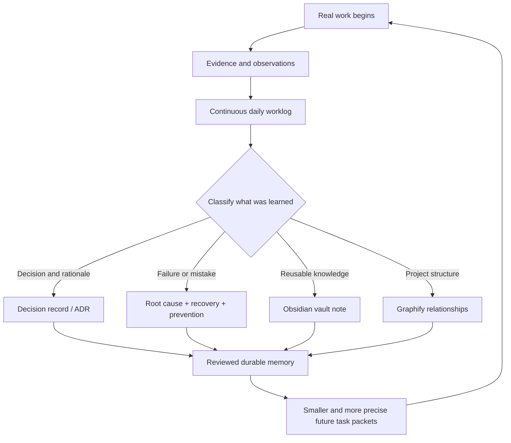
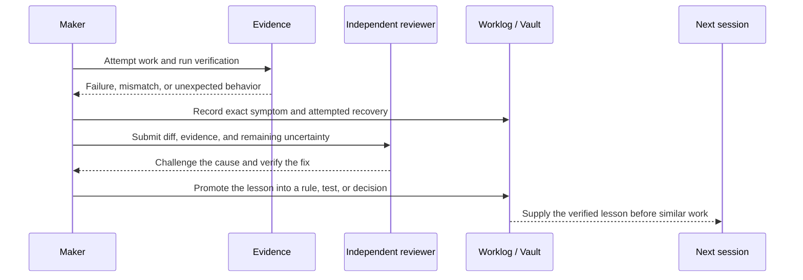
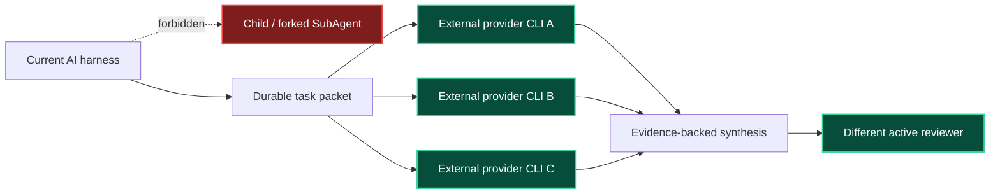
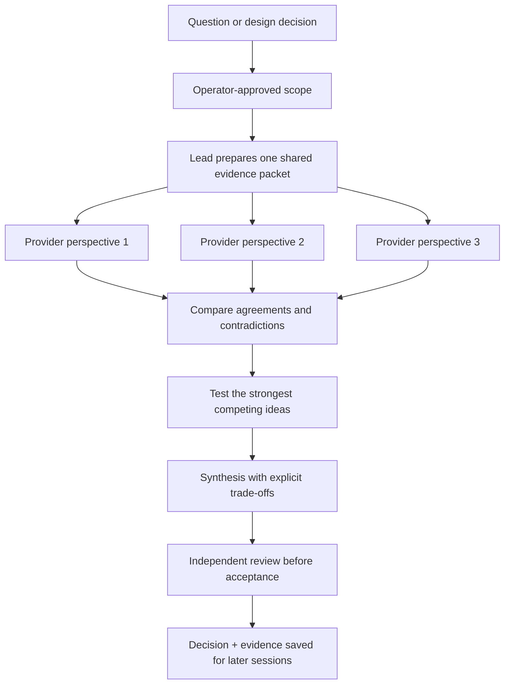
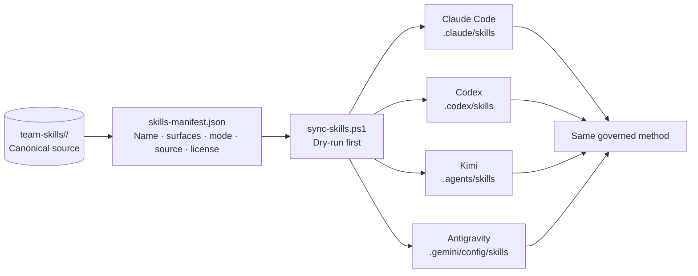
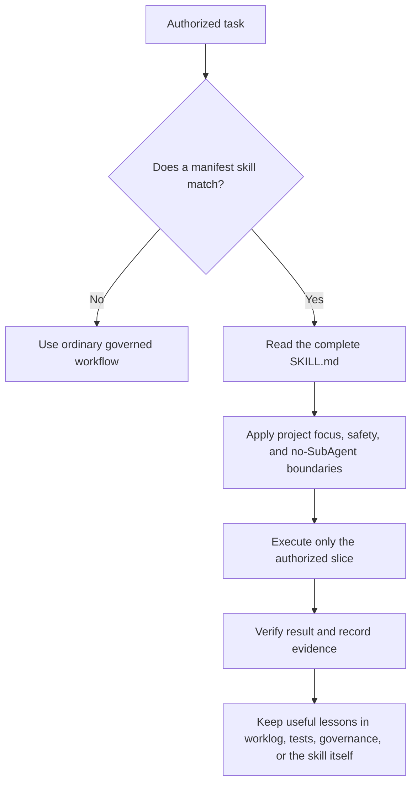
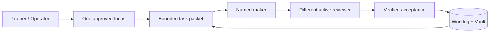

<div align="center">

# Agent Academy

### A local-first operating system for a team of AI collaborators

**Memory that compounds · Cross-provider review · No platform subagents · CLI-first**

[](LICENSE)
[](INSTALL.md)
[](#privacy-and-safety)
[](governance/no-subagents.md)
[](#accounts-subscriptions-and-api-keys)
[](#five-seats-today-adaptable-tomorrow)
[](#built-in-portable-skills)

Created and developed by **Pokpong Sittisak**

**English** · [ภาษาไทย](README-TH.md)

[Why it improves](#the-system-improves-every-time-it-works) · [No SubAgents](#no-subagents-real-external-perspectives) · [Provider diversity](#provider-diversity-and-meeting-modes)

[Get started](#five-minute-quickstart) · [Skills](#built-in-portable-skills) · [Workflow](#how-it-works) · [Obsidian](#obsidian-second-brain) · [Graphify](#graphify-knowledge-graph) · [Installation guide](INSTALL.md)

</div>

---

Agent Academy turns a collection of AI command-line tools into a governed working team. It provides each installation with explicit authority, one approved project focus, durable task packets, independent cross-provider review, a shared skill store, and an external memory that remains useful across sessions.

It becomes more capable as you use it—not by secretly retraining a foundation model, but by preserving verified decisions, worklogs, project context, and relationships that future sessions can retrieve and inspect.

> **Neutral public edition:** the bundled identities are original, generic, role-based, and fully customizable. The repository contains no operator identity, credentials, provider authentication, previous work history, or project-specific content.

> [!IMPORTANT]
> **Agent Academy never uses platform SubAgents.** Child, forked, nested, background, or `Waiting for agents` workers are not team members and cannot act as makers, reviewers, dispatchers, approvers, or evidence. Real collaboration means invoking separately authenticated external provider CLIs through direct wrappers and durable task packets.

> [!NOTE]
> **The Academy core requires no API key.** Install the system, authenticate each chosen CLI through its official login flow, and keep all provider credentials outside this repository. Some optional providers may still require their own key in a secure provider-owned configuration; that never becomes Academy content.

## The system improves every time it works

Agent Academy does not merely store the final answer. It preserves the path that made the answer trustworthy: the original goal, constraints, evidence, decisions, rejected alternatives, failed attempts, root causes, verification results, unresolved risks, and the exact checkpoint needed to resume.



Every meaningful cycle should retain five things:

| Record | Why it matters next time |
|---|---|
| **Decision** | Future sessions know what was chosen, why it was chosen, and which alternatives were rejected. |
| **Mistake or failed attempt** | The team does not repeat a command, assumption, architecture, or transport path that already failed. |
| **Evidence** | A later member can distinguish verified fact from confident-sounding recollection. |
| **Checkpoint** | Work can resume after a context limit, crash, quota reset, provider outage, or project switch. |
| **Prevention rule** | A useful lesson becomes a test, governance rule, skill update, or checklist instead of remaining a story. |

The result is compounding operational intelligence. A new session starts with more relevant context and fewer repeated mistakes than the session before it. This is **external, inspectable learning**—not hidden model training, automatic fine-tuning, or unreviewed self-modification.

### From an error to a stronger system



## No SubAgents, real external perspectives

The word *agent* is overloaded. Agent Academy draws a hard architectural boundary between a platform-created child process and an independently authenticated AI provider session.



| Concept | Meaning in Agent Academy |
|---|---|
| **Member** | A governed identity in `governance/roster.json` with authority, availability, durable inbox/outbox paths, and a configured transport. |
| **Provider** | A distinct external model/runtime vendor such as Anthropic, OpenAI, Google, Moonshot AI, or Z.AI. |
| **Session** | One real invocation of that provider's CLI under its own authentication and quota. |
| **Wrapper** | The local carrier that starts the configured CLI, passes a bounded packet, and returns evidence. |
| **SubAgent** | A child/forked worker created inside the current harness. It is forbidden regardless of label, persona, or apparent usefulness. |

Why forbid SubAgents so strongly?

- A child of the current harness usually inherits the same provider family, blind spots, context, and failure modes.
- Relabeling that child as another team member creates the appearance of independent review without actual provider independence.
- Platform-managed children often have weaker identity, transport, audit, and failure evidence than a durable provider-backed packet.
- A `Waiting for agents` indicator proves that the harness created children; it does not prove that Claude, Codex, Gemini, Kimi, or GLM independently reviewed anything.

The goal is not to maximize the number of AI processes. The goal is to obtain **genuinely different reasoning paths** and reconcile them against the same evidence.

## Provider diversity and meeting modes

Different model families are trained, aligned, served, and tooled differently. They often notice different risks, propose different abstractions, and fail in different ways. Agent Academy uses those differences deliberately instead of treating five copies of one model as five independent opinions.



The shipped Tier 1 transport may collect these replies serially. Independence comes from distinct provider runtimes and separate evidence-backed replies—not from simultaneous execution.

### How many providers do you need?

| Distinct provider families | Operating mode | What you gain | What you cannot claim |
|---:|---|---|---|
| **1** | Solo Academy | Focus control, worklogs, vault memory, skills, and local governance still work. | No cross-provider meeting and no provider-diverse opinion. A single active member also cannot satisfy the maker/reviewer gate for code. |
| **2** | Minimum meeting | A real disagreement, challenge, or maker/reviewer exchange can occur across two independent model families. | A two-sided debate can deadlock or share an unnoticed assumption. |
| **3** | Recommended baseline | Triangulation: one member proposes, one challenges, and one breaks ties or tests both approaches. | Still subject to correlated data, tooling, and ecosystem biases. |
| **4–5** | High-coverage team | Broader specialist strengths, better outage/quota resilience, and more chances to surface an unexpected approach. | More providers do not replace evidence, tests, or human authority. |

**Developer recommendation:** use at least **three distinct provider families** for the best balance of diversity, cost, and coordination. Two is the minimum for a genuine cross-provider meeting. One provider remains useful for solo work, but it cannot provide the kind of independent multi-company discussion this system was designed to capture.

### The developer-tested five-provider configuration

The original private installation created by **Pokpong Sittisak** has operated with five provider families:

| Academy seat | Provider family used by the developer | Intended contribution |
|---|---|---|
| Lead | **Claude / Anthropic** | Orchestration, synthesis, acceptance, and long-context judgment |
| Deputy | **Codex / OpenAI** | Implementation, debugging, verification, and resilient failover |
| Analyst | **Gemini / Google** | Independent analysis, research perspective, and evidence checking |
| Challenger | **Kimi / Moonshot AI** | Alternative approaches, assumption challenges, and creative dissent |
| Steward | **GLM / Z.AI** | Production-minded closure, additional model diversity, and bounded review |

This table records the developer's experience, not a claim that one provider is universally best for a role. Operators should choose providers based on current availability, language, privacy needs, tool support, quota, and local regulations.

## Accounts, subscriptions, and API keys

Agent Academy is designed for people who want convenient CLI collaboration without building or operating an API orchestration service.

### What the core actually requires

1. This repository and PowerShell.
2. At least one compatible AI CLI installed locally.
3. That CLI authenticated through the provider's official flow.
4. A `providers.json` containing executable and argument metadata—**never credentials**.

The Academy installer, roster, task packets, vault, wrappers, and governance do not require an API key. For the easiest day-to-day experience, the developer recommends at least one paid individual subscription with usable CLI quota—often called **Plus**, **Pro**, **Max**, or a *Coding Plan* depending on the provider. This is a practical quota recommendation, not a universal product name or a hard architectural requirement.

> [!CAUTION]
> Provider plans, quotas, regions, login methods, and product names change. Verify the linked official documentation before subscribing. Never paste a key, OAuth code, session token, recovery code, or browser cookie into this repository, chat, task packet, screenshot, or worklog.

### Current provider access patterns

Checked against official documentation on **2026-08-09**:

| Provider example | Convenient account/subscription path | API-key reality | Official reference |
|---|---|---|---|
| **Claude Code** | Browser login with an eligible Claude Pro, Max, Team, Enterprise, or Console account | Account login can avoid placing an API key in Academy. Claude Code also supports API/third-party provider paths. | [Claude Code setup](https://code.claude.com/docs/en/getting-started) |
| **Codex CLI** | Sign in with a ChatGPT account; available plans and limits vary | ChatGPT sign-in does not require an Academy-managed key. API use remains a separate optional path. | [Using Codex with a ChatGPT plan](https://help.openai.com/en/articles/11369540/) |
| **Gemini CLI** | Google OAuth login; the official CLI documents an individual free tier and paid organizational options | Google sign-in explicitly supports operation without API-key management; API key and Vertex AI modes remain optional. | [Gemini CLI authentication](https://github.com/google-gemini/gemini-cli#-authentication-options) |
| **Kimi Code CLI** | Kimi membership with OAuth device login | Officially supports either membership OAuth or a callable API key. Choose OAuth to keep Academy keyless. | [Kimi Code CLI getting started](https://www.kimi.com/help/kimi-code/cli-getting-started) |
| **GLM Coding Plan** | Subscribe to a Z.AI Coding Plan and connect a supported coding tool | The current official setup issues a provider API key. Keep it only in the supported tool's secure configuration—never in Academy files. | [GLM Coding Plan quick start](https://docs.z.ai/devpack/quick-start) |

<details>
<summary><strong>Why “Agent Academy needs no API key” remains accurate</strong></summary>

The Academy is the governance and transport layer, not the model billing layer. It never asks for a key and never needs to read one. A chosen provider may authenticate with OAuth, a paid account, an OS keychain, an environment variable, or a provider-specific config file. Those credentials belong to that provider boundary.

You can run an entirely account-authenticated Academy by choosing CLIs with official OAuth/browser login. If you add a provider whose supported integration requires a key, the provider may still work, but the key remains external to the Academy repository and is never copied into `providers.json`.

</details>

### Subscription strategy for a practical team

| Goal | Suggested setup |
|---|---|
| Learn the system cheaply | Start with one officially authenticated CLI; understand that meetings and provider diversity are unavailable. |
| Minimum real collaboration | Maintain two distinct provider accounts with enough quota for maker/reviewer or debate. |
| Best cost-to-quality balance | Maintain three distinct provider families, usually on paid individual plans with dependable CLI allocation. |
| Maximum diversity used by the developer | Claude + Codex + Gemini + Kimi + GLM, each authenticated and governed as a separate roster transport. |

Subscriptions belong to the individual or organization that purchased them. Do not share accounts between people, bypass provider limits, or assume that one provider's terms apply to another.

## Five seats today, adaptable tomorrow

The public reference roster ships with five stable seats because that is large enough to demonstrate lead, deputy, maker, challenger, analyst, and reviewer behavior across several providers. **Team size and provider count are separate concepts:** five members mapped to one provider do not create five independent provider perspectives.

- **Operate with fewer:** place unavailable members on leave and keep their identity/history. At least two active members are required to accept code under the maker/reviewer gate.
- **Operate with more:** add a deliberate roster migration—new stable id, persona, inbox/outbox paths, provider mapping, manifest coverage, and tests.
- **Rename freely:** display names and persona text are customizable during onboarding.
- **Do not casually rename ids:** ids are compatibility keys used by scripts and paths.

Adding or permanently removing seats is possible, but it is an explicit governance/schema migration rather than a cosmetic one-line toggle. This prevents a README promise from silently breaking dispatch, review eligibility, or durable history.

## Why Agent Academy

| Capability | What it changes |
|---|---|
| **One execution focus** | The team cannot silently abandon one project for another. Only the operator approves a focus change. |
| **Maker + reviewer gate** | A code change is written by one member and independently checked by another active member. |
| **Durable handoffs** | Assignments and replies survive model context limits because they are stored as small, inspectable files. |
| **Local-first memory** | Worklogs, decisions, and the Obsidian vault remain under the operator's control. |
| **Portable skills** | One canonical skill store can be synchronized across Claude Code, Codex, Antigravity, and compatible CLIs. |
| **Provider independence** | Generated wrappers connect real roster members to their configured runtimes without requiring a server or daemon. |
| **No platform subagents** | Child, forked, nested, or background agents cannot impersonate a team member or satisfy a review gate. |

## Built-in portable skills

Agent Academy ships with **28 curated skills** so a new installation begins with shared engineering methods instead of five disconnected assistants improvising five different processes. A skill is a focused instruction package: it tells a compatible CLI when a capability applies, what evidence to collect, which boundaries it must respect, and what a trustworthy result looks like.

Skills do not retrain a model, install a hidden service, or grant additional authority. They make repeatable methods portable across sessions and providers. Governance, project focus, operator approval, and the no-SubAgent rule always remain above every skill.

> [!IMPORTANT]
> **A skill is guidance, not permission.** Loading `security-review` does not authorize credential access; loading `docker-patterns` does not authorize deployment; loading `graphify` does not permit child workers. Every skill remains bounded by [`AGENTS.md`](AGENTS.md), [`governance/safety.md`](governance/safety.md), and [`governance/no-subagents.md`](governance/no-subagents.md).

### One canonical library, four CLI surfaces



[`team-skills/skills-manifest.json`](team-skills/skills-manifest.json) is the machine-readable source of truth. It declares which surface receives each skill, whether that surface uses a junction or a real mirror, any provider-specific overlay, and the source and license of redistributed work. Claude Code, Codex, and Kimi can use manifest-selected links or mirrors; Antigravity receives real mirrored directories because its loader does not discover reparse points.

This gives the team a shared playbook without pretending the providers are the same model. Claude, Codex, Gemini/Antigravity, Kimi, and other configured runtimes still contribute their own reasoning; the portable skill only aligns the method, evidence standard, and safety boundary.

### What is included

| Capability family | Skills | What the family contributes |
|---|---:|---|
| **Engineering and architecture** | 8 | API, backend, container, failure, database, React, visual-design, and accessibility discipline. |
| **Delivery and quality** | 7 | Research-first decisions, minimalism, systematic diagnosis, test-first work, verification, review handling, and security review. |
| **AI systems and agent operations** | 3 | LLM evaluation, project-level AI architecture, and diagnosis of quota/context/transport failures. |
| **Memory and knowledge** | 6 | Daily records, consolidation, contradiction detection, synthesis, Obsidian architecture notes, and Graphify relationships. |
| **Communication and presentation** | 2 | Audience-shaped operational communication and consistent visual themes. |
| **Team session operations** | 2 | Visible warm-session startup and exact-window cooldown. |
| **Total** | **28** | One versioned library distributed to every declared CLI surface. |

<details>
<summary><strong>Engineering and architecture — 8 skills</strong></summary>

| Skill | Purpose |
|---|---|
| [`accessibility-review`](team-skills/accessibility-review/) | Whole-screen accessibility review covering keyboard use, focus, screen readers, contrast, forms, zoom, mobile behavior, and Thai/English legibility. |
| [`api-design`](team-skills/api-design/) | Reviews HTTP resource paths, method safety, idempotency, status codes, response consistency, and list/filter/sort contracts. |
| [`backend-architecture-review`](team-skills/backend-architecture-review/) | Examines service boundaries, background work, reliability, reconciliation, correctable operations, auditability, and cross-cutting architecture. |
| [`docker-patterns`](team-skills/docker-patterns/) | Guides multi-stage, non-root containers, pinned images, network isolation, health checks, secrets, and writable runtime layout. |
| [`error-handling`](team-skills/error-handling/) | Establishes typed failures, boundary translation, retry eligibility, circuit-breaker prerequisites, and fail-open detection. |
| [`frontend-design`](team-skills/frontend-design/) | Helps produce deliberate visual hierarchy, typography, composition, and interface character instead of generic template styling. |
| [`prisma-patterns`](team-skills/prisma-patterns/) | Covers Prisma projections, N+1 prevention, transaction discipline, bulk-write risks, known errors, and migration lifecycle. |
| [`react-patterns`](team-skills/react-patterns/) | Covers render purity, hooks, state placement, client boundaries, forms, composition, performance measurement, and accessibility-first React. |

</details>

<details>
<summary><strong>Delivery and quality — 7 skills</strong></summary>

| Skill | Purpose |
|---|---|
| [`search-first`](team-skills/search-first/) | Searches the repository, installed capabilities, authoritative registries, and maintained patterns before recommending Adopt, Extend, Compose, or Build. |
| [`ponytail`](team-skills/ponytail/) | Applies YAGNI and selects the smallest solution that genuinely satisfies the requirement. |
| [`systematic-debugging`](team-skills/systematic-debugging/) | Requires evidence and root-cause isolation before proposing a fix for a defect or unexpected behavior. |
| [`tdd-workflow`](team-skills/tdd-workflow/) | Provides a test-first loop for an already authorized code slice. |
| [`verification-loop`](team-skills/verification-loop/) | Turns completion claims into inspectable evidence through proportional verification gates. |
| [`receiving-code-review`](team-skills/receiving-code-review/) | Evaluates review feedback technically before implementation instead of accepting suggestions performatively. |
| [`security-review`](team-skills/security-review/) | Performs a read-only, severity-ranked security review for an explicitly named sensitive scope without silently fixing or widening it. |

</details>

<details>
<summary><strong>AI systems and agent operations — 3 skills</strong></summary>

| Skill | Purpose |
|---|---|
| [`advanced-evaluation`](team-skills/advanced-evaluation/) | Designs calibrated LLM-as-judge, direct-scoring, pairwise-comparison, confidence, and bias-mitigation evaluations. |
| [`project-development`](team-skills/project-development/) | Helps decide whether an LLM is the right primitive and shapes multi-stage AI workflows, structured outputs, cost estimates, and iteration strategy. Academy's no-SubAgent override still applies. |
| [`agent-introspection-debugging`](team-skills/agent-introspection-debugging/) | Diagnoses agent-run loops, quota exhaustion, context drift, wrapper failures, and transport errors using the smallest contained recovery. |

</details>

<details>
<summary><strong>Memory and knowledge — 6 skills</strong></summary>

| Skill | Purpose |
|---|---|
| [`daily`](team-skills/daily/) | Creates or updates the day's durable work note. |
| [`consolidate`](team-skills/consolidate/) | Moves inbox knowledge into the vault without orphaning or overwriting important notes. |
| [`contradictions`](team-skills/contradictions/) | Finds conflicting vault statements and produces an inspectable report without auto-editing the source notes. |
| [`synthesis`](team-skills/synthesis/) | Performs bounded synthesis for a specified map of content rather than rewriting the entire vault. |
| [`obsidian-architect`](team-skills/obsidian-architect/) | Maintains a bounded architecture note in the vault while preserving human edits. |
| [`graphify`](team-skills/graphify/) | Builds and queries persistent relationship graphs across code and documents using deterministic extraction, an allowed direct backend, or bounded inline work—never SubAgents. |

</details>

<details>
<summary><strong>Communication and presentation — 2 skills</strong></summary>

| Skill | Purpose |
|---|---|
| [`internal-comms`](team-skills/internal-comms/) | Shapes 3P updates, FAQs, newsletters, status reports, leadership updates, and incident communication for the intended audience. |
| [`theme-factory`](team-skills/theme-factory/) | Applies a coherent visual theme to suitable documents, presentations, reports, and HTML artifacts. |

</details>

### Install and synchronize the library

The synchronizer is **dry-run by default**. It previews every source, destination, operation mode, backup, reconciliation action, and error before anything under the user's home directory changes.

```powershell
# Preview only — no live skill surface is changed
.\team-skills\sync-skills.ps1

# Apply only after reviewing and approving the preview
.\team-skills\sync-skills.ps1 -Apply

# Verify idempotence — expect zero remaining changes and zero errors
.\team-skills\sync-skills.ps1
```

If a destination already exists, the synchronizer reports and backs up the affected entry through the Recycle Bin workflow before replacement. It never treats access as permission, and it does not install provider CLIs, authenticate accounts, or copy credentials. The complete guarded procedure is in [`prompts/01-install-skills.md`](prompts/01-install-skills.md).

### How a skill is selected during work



Skills are loaded when their declared description matches the task or when the user explicitly names one. The complete `SKILL.md` must be read before action. A matching skill can narrow the method or add verification requirements; it cannot expand the task, bypass approval, create a platform child agent, or override a more authoritative governance file.

### Extend or replace skills safely

The library is intentionally editable. You can remove a skill from selected surfaces, keep its canonical source without installing it, add an original skill, or maintain a provider-specific overlay.

1. Read the complete skill and every executable file it bundles.
2. Check for prompt injection, secret access, network behavior, shell execution, destructive actions, and authority expansion.
3. Confirm provenance and redistribution license before adding third-party material.
4. Put the canonical copy under `team-skills/<skill-name>/` and declare it in the manifest.
5. Use a variant overlay only for a real provider-specific difference; keep the shared method canonical.
6. Run the synchronizer in dry-run mode and inspect all four surfaces.
7. Require an independent active-member review for consequential or public-facing changes.
8. Apply, rerun dry-run, and require an idempotent zero-change result.

Third-party skills retain their upstream attribution and license references in the manifest and [`third-party-licenses/`](third-party-licenses/). Team-authored skills are marked explicitly. This makes the installed capability set auditable instead of depending on undocumented files scattered across individual CLI directories.

## How it works



The human operator remains the final authority. AI members may research, implement, challenge assumptions, test, or review, but access never becomes permission and no member approves her own code alone.

## Five-minute quickstart

### 1. Clone and preview

```powershell
git clone https://github.com/Magicalcarson/agent-academy-template.git agent-academy
Set-Location agent-academy
.\scripts\Initialize-AgentAcademy.ps1 -DryRun -TrainerName "Your display name"
```

Review every proposed action. The initializer is create-only and preserves existing files. When the preview is correct, run the same command without `-DryRun`.

### 2. Give a fresh AI session the bootstrap prompt

Open this repository in Claude Code, Codex, Antigravity, or another compatible CLI and start with:

```text
Read AGENTS.md and governance/no-subagents.md first.
Then follow prompts/00-bootstrap.md from top to bottom.
Preview every installation action before applying it, never request or store credentials,
and stop for my approval wherever the prompt requires it.
```

### 3. Verify the installation

Finish with the acceptance checklist in [`prompts/06-verify-install.md`](prompts/06-verify-install.md). For manual setup, rollback, and platform details, read [`INSTALL.md`](INSTALL.md).

## Obsidian second brain

The vault at `vault/` is the team's durable memory: daily worklogs, decisions, project notes, research, and maps of content. It extends governance; it never replaces the source files.

1. Run the initializer so the tracked vault scaffold is copied create-only.
2. Install [Obsidian](https://obsidian.md/) from its official distribution and open `vault/`.
3. Follow [`prompts/02-install-obsidian-vault.md`](prompts/02-install-obsidian-vault.md).
4. Install **Force Read Mode** through Obsidian's Community plugins browser if desired.
5. Run the privacy gate before creating optional governance or memory junctions.

```powershell
.\scripts\Invoke-PrivacyGate.ps1 -Root .
```

## Graphify knowledge graph

Graphify turns code and documents into a persistent, queryable relationship graph. Agent Academy treats graph builds as single-writer operations: acquire the project lock, build in staging, verify the result, and never let two members write the graph simultaneously.

Install it only after approving the package download:

```powershell
uv tool install graphifyy
graphify --help
```

If `uv` is unavailable, use `python -m pip install graphifyy`. Then follow [`prompts/03-install-graphify.md`](prompts/03-install-graphify.md).

| Command | Purpose |
|---|---|
| `/graphify` | Build a graph for the current workspace. |
| `/graphify query "How does review work?"` | Retrieve broad context from the existing graph. |
| `/graphify path "Task packet" "Acceptance"` | Trace the shortest relationship path. |
| `/graphify explain "Project focus"` | Explain one concept using graph evidence. |
| `/graphify --update` | Re-extract only content that changed. |

The Academy-wide no-subagent rule still applies during Graphify work. Use deterministic extraction, an allowed direct backend, or bounded inline extraction—never child-agent workers.

## How the system gets better with use

```text
Meaningful work
      ↓
Continuous worklog
      ↓
Reviewed decisions and durable notes
      ↓
Obsidian links + Graphify relationships
      ↓
Smaller, more accurate future task packets
      ↺
```

This loop reduces repeated discovery and context loss. Improvement comes from better external memory and verified retrieval—not from automatic model fine-tuning, hidden learning, or unreviewed self-modification.

## What is included

- five original role-based identities with renameable display names and replaceable persona text;
- portable governance for focus, dispatch, review, safety, deletion, language, and worklogs;
- [28 curated portable skills](#built-in-portable-skills) with a manifest-driven cross-CLI synchronizer;
- generated PowerShell wrappers for configured providers;
- optional visible warm-session startup, durable packet delivery, and exact-window cooldown;
- an Obsidian vault scaffold with portable settings;
- Graphify installation and single-writer guidance; and
- ordered prompts that guide a fresh CLI through installation and verification.

## Repository map

| Path | Purpose |
|---|---|
| [`governance/`](governance/) | Authoritative human and machine-readable operating rules |
| [`agents/`](agents/) | Voice and personality references for the five stable member ids |
| [`prompts/`](prompts/) | AI-guided onboarding, one bounded subsystem at a time |
| [`team-skills/`](team-skills/) | Canonical portable skill store and synchronizer |
| [`scripts/`](scripts/) | Initialization, wrappers, hooks, focus, dispatch, and verification |
| [`templates/`](templates/) | Vault, provider, task, project, worklog, and decision seeds |
| `inbox/` and `outbox/` | Durable assignments and member replies |
| `meetings/`, `projects/`, and `vault/` | Shared discussion, project records, and long-term memory |

## Privacy and safety

- Credentials remain in each CLI's secure configuration and never enter this repository.
- Installers preview first, preserve existing content, and require approval before external writes.
- Destructive actions use the Recycle Bin or trash and require explicit confirmation.
- Project work must match the operator-approved focus.
- Every code-changing task has a named maker and a different active reviewer.
- Platform child/forked subagents are forbidden by [`governance/no-subagents.md`](governance/no-subagents.md).
- A publishable copy must pass `scripts/Invoke-PrivacyGate.ps1`.

Never import another person's vault, logs, credentials, private messages, machine configuration, or project artifacts into a public template.

## Optional visible warm sessions

Add provider-native `interactiveArguments` to the untracked `providers.json`, then preview before opening or closing any window:

```powershell
.\scripts\warmup-team.ps1 -Dispatcher academy-lead -WhatIf
.\scripts\warmup-team.ps1 -Dispatcher academy-lead
.\scripts\cooldown-team.ps1 -Dispatcher academy-lead -WhatIf
```

Use `scripts/send-team-session.ps1` only after creating a durable inbox packet. Cooldown posts `WM_CLOSE` to each exact recorded window; it never kills the shared Windows Terminal process.

## Naming and customization

The defaults—Academy Lead, Academy Deputy, Academy Analyst, Academy Challenger, and Academy Steward—are generic role labels created for this public edition. Operators may replace display names and persona text during onboarding. Stable member ids and paths remain compatibility keys unless deliberately migrated.

Names and personas selected in a private installation reflect the operator's or developer's personal preferences. They may be changed and do not imply endorsement, sponsorship, affiliation, or an intention to profit from any third-party name or identity. A disclaimer does not grant rights to third-party material; public distributions should use original or properly licensed content.

## License and attribution

Agent Academy was initiated, designed, and developed by **Pokpong Sittisak** and is distributed under the [MIT License](LICENSE). Copies or substantial portions must preserve the copyright and permission notice.

When practical, the developer also requests this human-readable credit; it is not an additional license condition:

```text
Agent Academy
Created and developed by Pokpong Sittisak
```

Read the [project notice](NOTICE.md), [third-party notices](THIRD_PARTY_NOTICES.md), and [publication checklist](PUBLICATION.md) before distributing a copy.

---

<div align="center">

**Agent Academy — created and developed by Pokpong Sittisak.**

Built for systems that remember the work, verify the result, and improve with every well-recorded decision.

</div>
